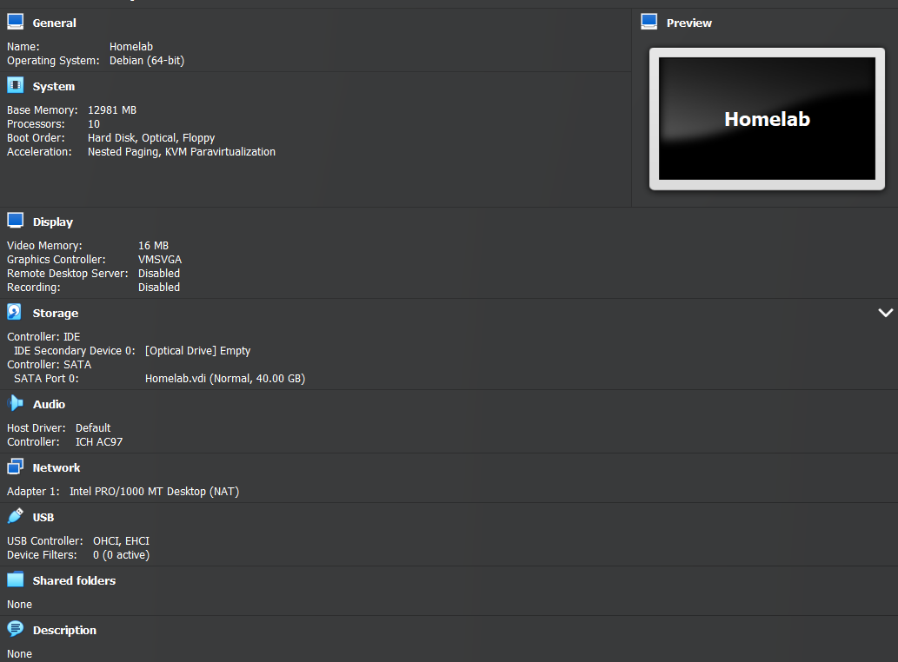

# Table of Contents
1. [Homelab VM](#homelab-vm-setup)
1. [Veracrypt](#veracrypt)

## Homelab VM Setup
I set up a Debian VM starting but I could have done Ubuntu or any popular distro.  I chose Debian as that's what I'm learning at the moment.
1. Install [VirtualBox](https://www.virtualbox.org/)
1. Download latest [Debian ISO (currently 13 (Trixie))](https://cdimage.debian.org/debian-cd/current/amd64/iso-cd/debian-13.3.0-amd64-netinst.iso)
    - Or Ubuntu Download latest [Ubuntu 24.04 LTS](https://ubuntu.com/download/desktop/thank-you?version=24.04.4&architecture=amd64&lts=true)
    - 
    - 10 Cores
    - 12-ish GB of RAM
1. Set the VM's USB devices to be USB 3.0 (xHCI Controller) to allow passthrough for the USB drives I use
1. Install Guest Additions iso
    - Following: [Link](https://superuser.com/a/950443)
    - Mount the guest iso
    - Navigate to the `/mnt/` directory
    - `sh ./VBoxLinuxAdditions.run`
        - Found at: [Link](https://forums.virtualbox.org/viewtopic.php?p=549193&sid=a:2a7a9daa05f3c6104587b7de2767c45a#p549193)
    - Restart the machine after the install completes, as my keyboard borked & VirtualBox froze for some reason.
1. `apt update && apt upgrade -y`
1. Begin following the yubico [veracrypt tutorial](https://yubico.gitbook.io/yubikey5/tutorials/veracrypt)
    - I created the keyfile + veracrypt volume in a liveboot Mint instance so there're no logs of them being created
    - Actual first step is [Installing OpenSC](https://yubico.gitbook.io/yubikey5/tutorials/veracrypt#installing-opensc)
1. `apt install opensc`
    - After install the opensc-pk11.so package will exist in the `/lib/x86_x64-linux-gnu/` filepath
    - This'll be important to note to be able to manage keyfiles in Veracrypt
1. `apt install yubikey-manager`
    - This is the Yubikey manager created by Yubikey

## Veracrypt
