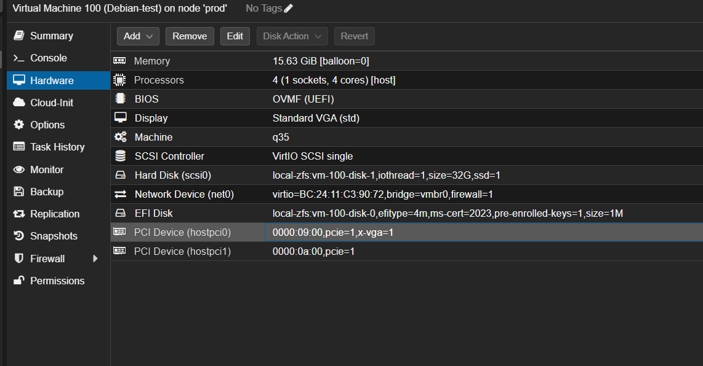
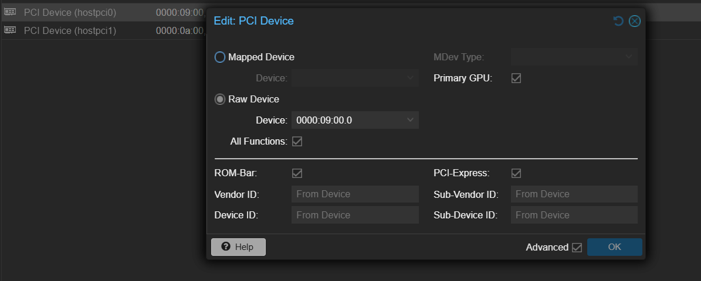

# Clean Install Init
1. Install Proxmox (Current version is 9.1)
1. Run [Post Install Helper Script](https://community-scripts.github.io/ProxmoxVE/scripts?id=post-pve-install)
    - `bash -c "$(curl -fsSL https://raw.githubusercontent.com/community-scripts/ProxmoxVE/main/tools/pve/post-pve-install.sh)"`
    1. Disable `pve-enterprise`
    1. Disable `ceph-enteprise`
    1. Add `pve-no-subscription` 
    1. Don't add `ceph-enterprise`
    1. Don't add `pvetest`
    1. Disable subscription nag
    1. Disable high availability
    1. Disable Corosync
    1. Update Proxmox VE
    1. Reboot
        - Outputs: Completed Post Install Routines

## Setup Passthrough & Disable i915/XE Graphics in Proxmox
1. Validate AMD IOMMU is on
    - Copied from here: [Link](https://forum.proxmox.com/threads/enabling-iommu.119217/post-517232)
    - `for d in /sys/kernel/iommu_groups/*/devices/*; do n=${d#*/iommu_groups/*}; n=${n%%/*}; printf 'IOMMU group %s ' "$n"; lspci -nns "${d##*/}"; done`
    - Ouput should be along the lines of:
    ```
    IOMMU group 0 00:01.0 Host bridge [0600]: Advanced Micro Devices, Inc. [AMD] Raphael/Granite Ridge Dummy Host Bridge [1022:14da]
    IOMMU group 10 00:18.0 Host bridge [0600]: Advanced Micro Devices, Inc. [AMD] Raphael/Granite Ridge Data Fabric; Function 0 [1022:14e0]
    IOMMU group 10 00:18.1 Host bridge [0600]: Advanced Micro Devices, Inc. [AMD] Raphael/Granite Ridge Data Fabric; Function 1 [1022:14e1]
    IOMMU group 10 00:18.2 Host bridge [0600]: Advanced Micro Devices, Inc. [AMD] Raphael/Granite Ridge Data Fabric; Function 2 [1022:14e2]
    IOMMU group 10 00:18.3 Host bridge [0600]: Advanced Micro Devices, Inc. [AMD] Raphael/Granite Ridge Data Fabric; Function 3 [1022:14e3]
    IOMMU group 10 00:18.4 Host bridge [0600]: Advanced Micro Devices, Inc. [AMD] Raphael/Granite Ridge Data Fabric; Function 4 [1022:14e4]
    IOMMU group 10 00:18.5 Host bridge [0600]: Advanced Micro Devices, Inc. [AMD] Raphael/Granite Ridge Data Fabric; Function 5 [1022:14e5]
    IOMMU group 10 00:18.6 Host bridge [0600]: Advanced Micro Devices, Inc. [AMD] Raphael/Granite Ridge Data Fabric; Function 6 [1022:14e6]
    IOMMU group 10 00:18.7 Host bridge [0600]: Advanced Micro Devices, Inc. [AMD] Raphael/Granite Ridge Data Fabric; Function 7 [1022:14e7]
    IOMMU group 11 01:00.0 PCI bridge [0604]: Intel Corporation Device [8086:e2ff] (rev 01)
    IOMMU group 12 02:01.0 PCI bridge [0604]: Intel Corporation Device [8086:e2f0]
    IOMMU group 13 02:02.0 PCI bridge [0604]: Intel Corporation Device [8086:e2f1]
    IOMMU group 14 03:00.0 VGA compatible controller [0300]: Intel Corporation Battlemage G21 [Intel Graphics] [8086:e212]
    IOMMU group 15 04:00.0 Audio device [0403]: Intel Corporation Device [8086:e2f7]
    IOMMU group 16 05:00.0 PCI bridge [0604]: Advanced Micro Devices, Inc. [AMD] 600 Series Chipset PCIe Switch Upstream Port [1022:43f4] (rev 01)
    IOMMU group 17 06:00.0 PCI bridge [0604]: Advanced Micro Devices, Inc. [AMD] 600 Series Chipset PCIe Switch Downstream Port [1022:43f5] (rev 01)
    IOMMU group 17 07:00.0 PCI bridge [0604]: Intel Corporation Device [8086:4fa1] (rev 01)
    IOMMU group 17 08:01.0 PCI bridge [0604]: Intel Corporation Device [8086:4fa4]
    IOMMU group 17 08:04.0 PCI bridge [0604]: Intel Corporation Device [8086:4fa4]
    IOMMU group 17 09:00.0 VGA compatible controller [0300]: Intel Corporation DG2 [Arc A310] [8086:56a6] (rev 05)
    IOMMU group 17 0a:00.0 Audio device [0403]: Intel Corporation DG2 Audio Controller [8086:4f92]
    IOMMU group 18 06:08.0 PCI bridge [0604]: Advanced Micro Devices, Inc. [AMD] 600 Series Chipset PCIe Switch Downstream Port [1022:43f5] (rev 01)
    IOMMU group 18 0b:00.0 PCI bridge [0604]: ASPEED Technology, Inc. AST1150 PCI-to-PCI Bridge [1a03:1150] (rev 06)
    IOMMU group 18 0c:00.0 VGA compatible controller [0300]: ASPEED Technology, Inc. ASPEED Graphics Family [1a03:2000] (rev 52)
    IOMMU group 19 06:09.0 PCI bridge [0604]: Advanced Micro Devices, Inc. [AMD] 600 Series Chipset PCIe Switch Downstream Port [1022:43f5] (rev 01)
    IOMMU group 19 0d:00.0 Ethernet controller [0200]: Intel Corporation Ethernet Controller I226-LM [8086:125b] (rev 04)
    IOMMU group 1 00:01.1 PCI bridge [0604]: Advanced Micro Devices, Inc. [AMD] Raphael/Granite Ridge GPP Bridge [1022:14db]
    IOMMU group 20 06:0a.0 PCI bridge [0604]: Advanced Micro Devices, Inc. [AMD] 600 Series Chipset PCIe Switch Downstream Port [1022:43f5] (rev 01)
    IOMMU group 20 0e:00.0 Ethernet controller [0200]: Realtek Semiconductor Co., Ltd. Device [10ec:8127] (rev 05)
    IOMMU group 21 06:0b.0 PCI bridge [0604]: Advanced Micro Devices, Inc. [AMD] 600 Series Chipset PCIe Switch Downstream Port [1022:43f5] (rev 01)
    IOMMU group 22 06:0c.0 PCI bridge [0604]: Advanced Micro Devices, Inc. [AMD] 600 Series Chipset PCIe Switch Downstream Port [1022:43f5] (rev 01)
    IOMMU group 22 10:00.0 USB controller [0c03]: Advanced Micro Devices, Inc. [AMD] 800 Series Chipset USB 3.x XHCI Controller [1022:43fc] (rev 01)
    IOMMU group 23 06:0d.0 PCI bridge [0604]: Advanced Micro Devices, Inc. [AMD] 600 Series Chipset PCIe Switch Downstream Port [1022:43f5] (rev 01)
    IOMMU group 23 11:00.0 SATA controller [0106]: Advanced Micro Devices, Inc. [AMD] 600 Series Chipset SATA Controller [1022:43f6] (rev 01)
    IOMMU group 24 12:00.0 VGA compatible controller [0300]: Advanced Micro Devices, Inc. [AMD/ATI] Granite Ridge [Radeon Graphics] [1002:13c0] (rev d1)
    IOMMU group 25 12:00.2 Encryption controller [1080]: Advanced Micro Devices, Inc. [AMD] Family 19h PSP/CCP [1022:1649]
    IOMMU group 26 12:00.3 USB controller [0c03]: Advanced Micro Devices, Inc. [AMD] Raphael/Granite Ridge USB 3.1 xHCI [1022:15b6]
    IOMMU group 27 12:00.4 USB controller [0c03]: Advanced Micro Devices, Inc. [AMD] Raphael/Granite Ridge USB 3.1 xHCI [1022:15b7]
    IOMMU group 28 13:00.0 USB controller [0c03]: Advanced Micro Devices, Inc. [AMD] Raphael/Granite Ridge USB 2.0 xHCI [1022:15b8]
    IOMMU group 2 00:02.0 Host bridge [0600]: Advanced Micro Devices, Inc. [AMD] Raphael/Granite Ridge Dummy Host Bridge [1022:14da]
    IOMMU group 3 00:02.1 PCI bridge [0604]: Advanced Micro Devices, Inc. [AMD] Raphael/Granite Ridge GPP Bridge [1022:14db]
    IOMMU group 4 00:03.0 Host bridge [0600]: Advanced Micro Devices, Inc. [AMD] Raphael/Granite Ridge Dummy Host Bridge [1022:14da]
    IOMMU group 5 00:04.0 Host bridge [0600]: Advanced Micro Devices, Inc. [AMD] Raphael/Granite Ridge Dummy Host Bridge [1022:14da]
    IOMMU group 6 00:08.0 Host bridge [0600]: Advanced Micro Devices, Inc. [AMD] Raphael/Granite Ridge Dummy Host Bridge [1022:14da]
    IOMMU group 7 00:08.1 PCI bridge [0604]: Advanced Micro Devices, Inc. [AMD] Raphael/Granite Ridge Internal GPP Bridge to Bus [C:A] [1022:14dd]
    IOMMU group 8 00:08.3 PCI bridge [0604]: Advanced Micro Devices, Inc. [AMD] Raphael/Granite Ridge Internal GPP Bridge to Bus [C:A] [1022:14dd]
    IOMMU group 9 00:14.0 SMBus [0c05]: Advanced Micro Devices, Inc. [AMD] FCH SMBus Controller [1022:790b] (rev 71)
    IOMMU group 9 00:14.3 ISA bridge [0601]: Advanced Micro Devices, Inc. [AMD] FCH LPC Bridge [1022:790e] (rev 51)
    ```
1. Add VFIO to the modules`nano /etc/modules`
    - Paste: 
        ``` 
        vfio
        vfio_iommu_type1
        vfio_pci
        ```
    - Save and close
1. Add ``iommu=pt` to grub command line
    1. Call `nano /etc/default/grub` to edit the grub file
    1. Add `iommu=pt` to the default command line
    1. Save & quit the file
    1. Call `update-grub`
1. Blacklist `xe` & `i915` drivers
    1. Navigate to `/etc/modprobe.d/`
    1. Create & edit a `blacklist.conf` file with `nano blacklist.conf`
    1. Add the following 2 lines
    ```
    blacklist xe
    blacklist i915
    ```
    1. Call `echo "softdep xe pre: vfio-pci" >> /etc/modprobe.d/xe.conf`
    1. Call `echo "softdep i915 pre: vfio-pci" >> /etc/modprobe.d/i915.conf`
    1. Create & edit a `vfio.conf` file with `nano vfio.conf`
    1. Add the following line: `options vfio-pci ids=8086:e212,8086:56a6`
        - Depending on where the physical device is in the motherboad, these IDs may change(?)
    1. Update initramfs to update the modules `update-initramfs -u -k all`
1. Reboot Proxmox: `reboot now`
1. Validate if the `xe` or `i915` drivers are loaded by calling `lspci -nnk`
    - You should see a screen for anything that uses those drivers with the output: 
    <br>
    
1. Passthrough should now be good to go for the Intel A310 & the Intel B50 GPUs

### Actually do the passthrough for the A310 into a Debian 13 VM as a test
1. Download the Debian OS into Proxmox
    - Stable [http-fpt](https://www.debian.org/CD/http-ftp/#stable) site
    - Choose CD or DVD (CD requires more stuff to be installed opver network post install)
    - [Link](https://cdimage.debian.org/debian-cd/current/amd64/iso-cd/)
1. Make sure you validate the SHA to make sure the ISO hasn't been tampered with
1. Create a VM in Proxmox
    - Don't attach the passed through devices you're interested in immediately as you'll lose GUI console access
1. Set up the VM with:
    1. CPU cores: Host
    1. RAM: Non-Ballooning as that can cause issues
    1. BIOS: OVMF (UEFI)
    1. Display: Default
    1. Machine: q35
1. Follow install instructions as needed
1. Install SSH as I'll be using putty for any actual hardware usage due to losing console access
1. Once the VM has been set up & the OS installed, you can now add the GPU as a passthroughed device
    - I had to passthrough both my GPU + GPU's audio as 2 separate PCI devices
    - Select PCI Device & Primary GPU fo the GPU side of things.
    - Should look something like: 
    <br>
    
    <br>
    
1. Now you can boot the VM again, and you can start installing more packages & forcing the `i915` driver off
    - Packages can be installed earlier but ¯\\_(ツ)_/¯
1. Call `nano /etc/default/grub` in the VM to edit the VM's boot details
1. Update the cmdline to include `i915.force_probe=!56a6 xe.force_probe=56a6`
    - End result: `GRUB_CMDLINE_LINUX_DEFAULT="quiet i915.force_probe=!56a6 xe.force_probe=56a6"`
1. Update Grub + initramfs: 
    - `update-grub`
    - `update-initramfs -u -k all`
1. Reboot
1. Call `lspci -k | grep -A4 VGA` and you should get a response that the `kernel drive in use: xe` for the GPU

### Validate that Passthrough exposes the correct info
1. Run `apt install -y intel-media-va-driver libva2 libva-drm2 vainfo ffmpeg`
    - `intel-media-va-driver` contains the Arc driver & VAAPI driver stuff
    - `vainfo` is used to validation of what's supported by the GPU
    - `ffmpeg` is the actual test tool
1. Enable `*_qsv` functionality with the following libraries: `apt install libvpl2 libvpl-dev`
1. Update VAAPI to use DRM since it's a headless install
    - `export LIBVA_DRIVER_NAME=iHD`
    - `export LIBVA_DRIVERS_PATH=/usr/lib/x86_64-linux-gnu/dri`
1. Validate `card0` & `renderD128` exist and are available to use
    - `ls -l /dev/dri/`
    - The output will be something like:
    <br>
    ```
    total 0
    drwxr-xr-x  2 root root        100 Jan 11 20:55 by-path
    crw-rw----+ 1 root video  226,   0 Jan 11 20:55 card0
    crw-rw----+ 1 root video  226,   1 Jan 11 20:55 card1
    crw-rw----+ 1 root render 226, 128 Jan 11 20:55 renderD128
    ```
1. Call `vainfo --display drm --device /dev/dri/renderD128`
    - This sees what the GPU is pushing as available for supported profiles
    - The output will be something like:
    <br>
    ```
    Trying display: drm
    libva info: VA-API version 1.22.0
    libva info: User environment variable requested driver 'iHD'
    libva info: Trying to open /usr/lib/x86_64-linux-gnu/dri/iHD_drv_video.so
    libva info: Found init function __vaDriverInit_1_22
    libva info: va_openDriver() returns 0
    vainfo: VA-API version: 1.22 (libva 2.22.0)
    vainfo: Driver version: Intel iHD driver for Intel(R) Gen Graphics - 25.2.3 ()
    vainfo: Supported profile and entrypoints
    VAProfileNone                   : VAEntrypointVideoProc
    VAProfileNone                   : VAEntrypointStats
    VAProfileMPEG2Simple            : VAEntrypointVLD
    VAProfileMPEG2Main              : VAEntrypointVLD
    VAProfileH264Main               : VAEntrypointVLD
    VAProfileH264Main               : VAEntrypointEncSliceLP
    VAProfileH264High               : VAEntrypointVLD
    VAProfileH264High               : VAEntrypointEncSliceLP
    VAProfileJPEGBaseline           : VAEntrypointVLD
    VAProfileJPEGBaseline           : VAEntrypointEncPicture
    VAProfileH264ConstrainedBaseline: VAEntrypointVLD
    VAProfileH264ConstrainedBaseline: VAEntrypointEncSliceLP
    VAProfileHEVCMain               : VAEntrypointVLD
    ........
    ```


### Validate with ffmpeg built-in test, VAAPI test, and finally Big Buck Bunny
1. `cd ../home`
1. Run:
    ```
    ffmpeg -y
        -f lavfi \
        -i testsrc2=size=1920x1080:rate=30 \
        -t 10 \
        -pix_fmt yuv420p \
        test-h264.mp4
    ```
    - This will output a file to a test-h264.mp4 file
    - There should be no errors
    - There should be an output like: `frame=  300 fps= 78 q=-1.0 Lsize=    7489KiB time=00:00:09.93 bitrate=6175.8kbits/s speed=2.59x`
1. Testing VAAPI decodes run:
    ```
    ffmpeg -hide_banner \
        -hwaccel vaapi \
        -hwaccel_device /dev/dri/renderD128 \
        -hwaccel_output_format vaapi \
        -i test-h264.mp4 -f null -
    ```
    - There should be an output like: `frame=  300 fps=0.0 q=-0.0 Lsize=N/A time=00:00:10.00 bitrate=N/A speed=30.8x`
1. Download [Big Buck Bunny](https://download.blender.org/peach/bigbuckbunny_movies/)
    - ChatGPT chose the smaller version to help me as it's a quicker download
    - `wget -O test.mp4 https://download.blender.org/peach/bigbuckbunny_movies/BigBuckBunny_320x180.mp4`
1. Actually test a VAAPI transcode
    ```
    ffmpeg -hide_banner -hwaccel vaapi \
        -hwaccel_device /dev/dri/renderD128 \
        -hwaccel_output_format vaapi \
        -i test.mp4 -f null -
    ```
1. Test an AV1 decode:
    ```
    ffmpeg -y \
    -f lavfi \
    -i testsrc2=size=1280x720:rate=30 \
    -t 10 \
    -pix_fmt yuv420p \
    test-av1.mkv
    ```
    - This is a software encode but it shows that software encodes work

# TODO:
- redo this with ubuntu