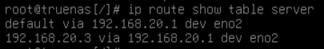
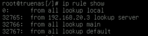
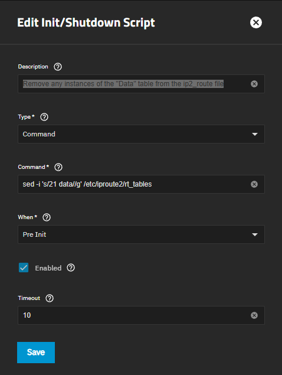
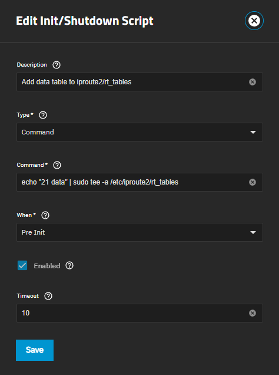
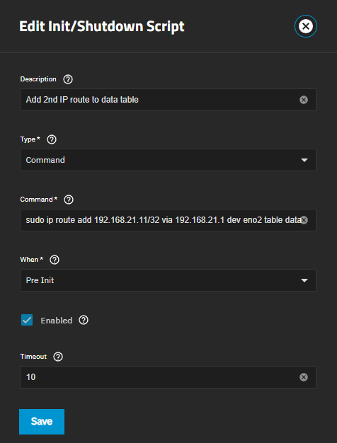
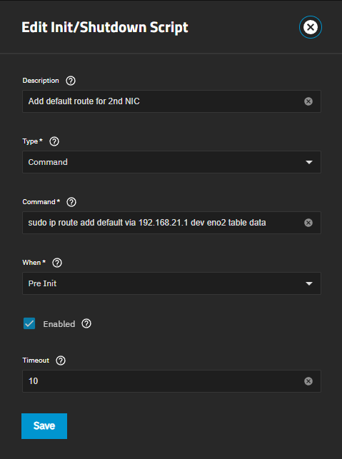
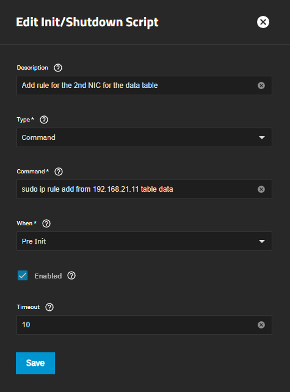
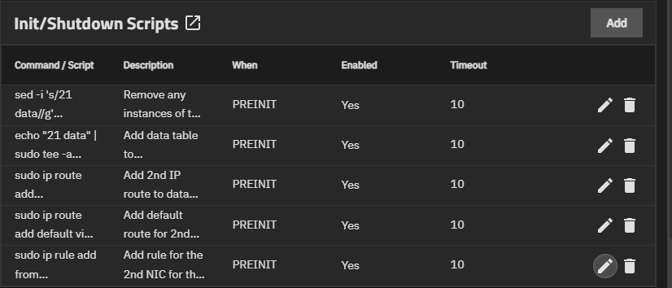

# Install

## Set up SMB NIC Routing
### Way #1 use CLI to modify /etc/rc.local
Yes, this isn't best practice or something, but this is a good way for me to segment my management web gui separate from the SMB share.
I was unable to get this working correctly via the "Static Routes" section in the Networking section.
1. `echo "20 data" | sudo tee -a /etc/iproute2/rt_tables`
    - Create routing table entry
1. `sudo ip route add 192.168.20.3/32 via 192.168.20.1 dev eno2 table data`
    - Create new table route for my data VLAN
1. `sudo ip route add default via 192.168.20.1 dev eno2 table data`
    - Create the Default route to point to the correct gateway for return traffic instead of the Management default
1. `sudo ip rule add from 192.168.20.3 table data`
    - Add the data rule to the "data" NIC so it is aware of the route
1. `ip route show table data`
    - Validate that the routing table and routes exist
    - 
    - The image shows that the table name is "dev" not data
1. `ip rule show`
    - Make sure the rules exist
    - 
1. `sudo nano /etc/rc.local`
    - <ins>The routes are set up to be temporary and do not survive a reboot so now the routes need to be added to the /etc/rc.local file</ins>
1. Copy and paste the following into the file 
    - This is equivalent to what was done in rules 1-6, however the changes will be permanent
    - `ip route add 192.168.20.3/32 via 192.168.20.1 dev eno2 table data`
    - `ip route add default via 192.168.20.1 dev eno2 table data`
    - `ip rule add from 192.168.20.3 table data`
1. Save and Quit the file
1. `sudo systemctl restart networking`
    - Restart the system networking to validate that the config is working as expected

### Way #2 use the Init/Shutdown Scripts to modify the routes on boot
This is what I'm actually using in prod, I know that this is poor practice and kinda hacky, but if it works it works ¯\\_(ツ)_/¯
1. Clear the any lines of the iproute2 rt_tables file that has the string "21 data" in it
    - Description: `Remove any instances of the "Data" table from the ip2_route file`
    - Command: `sed -i 's/21 data//g' /etc/iproute2/rt_tables`
    - When: `Pre Init`
    - 
1. Add the data table from iproute2 rt_tables file
    - Description: `Add data table to iproute2/rt_tables`
    - Command: `echo "21 data" | sudo tee -a /etc/iproute2/rt_tables`
    - When: `Pre Init`
    - 
1. Add the main route from the data IP to the gateway
    - Description: `Add 2nd IP route to data table`
    - Command: `sudo ip route add 192.168.21.11/32 via 192.168.21.1 dev eno2 table data`
    - When: `Pre Init`
    - 
1. Make the data table the default table w/e the default route that matches what was just added to the route table
    - Description: `Add default route for 2nd NIC`
    - Command: `sudo ip route add default via 192.168.21.1 dev eno2 table data`
    - When: `Pre Init`
    - 
1. Add the table rule to the 2nd IP address so that it can now see where to send the data
    - Description: `Add rule for the 2nd NIC for the data table`
    - Command: `sudo ip rule add from 192.168.21.11 table data`
    - When: `Pre Init`
    - 
1. Final view of the scripts should look like pic below
    - 